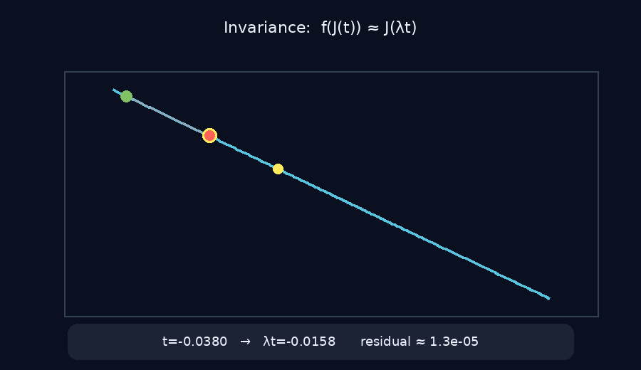
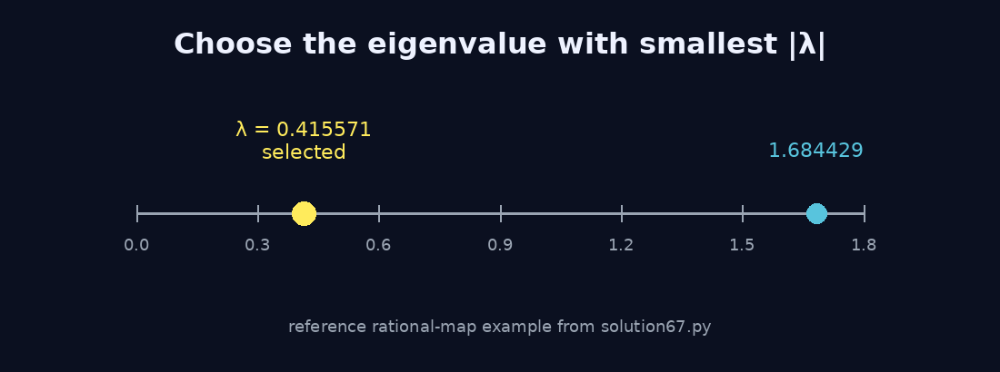
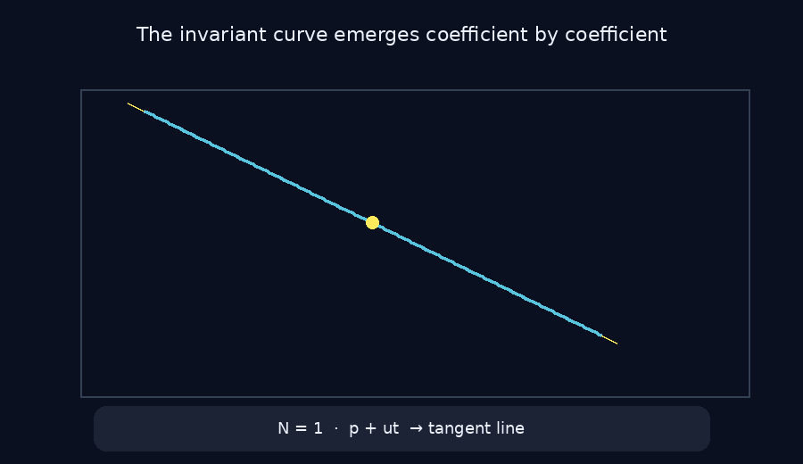
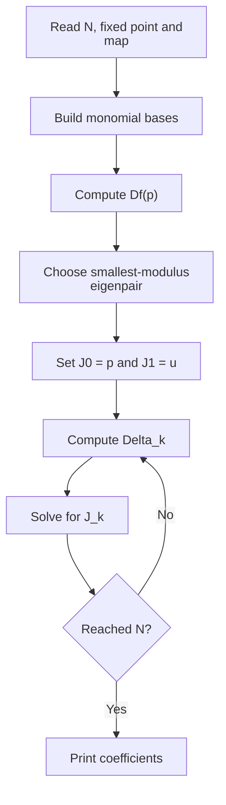

<p align="center">
  
</p>

<p align="center">
  <b>Taylor parameterization of a one-dimensional invariant manifold for rational maps.</b><br>
  Find the eigendirection. Build the series. Match the dynamics.
</p>

<p align="center">
  
  
  
  
</p>

---

## The idea

Let

```math
f:\mathbb{R}^n\rightarrow\mathbb{R}^n
```

be a rational map with a known fixed point $p$:

```math
f(p)=p.
```

We want a one-dimensional curve

```math
J:\mathbb{R}\rightarrow\mathbb{R}^n
```

passing through $p$ and invariant under the dynamics.

The central equation is

```math
f(J(t))=J(\lambda t).
```

Geometrically, applying $f$ to a point on the curve is equivalent to rescaling its parameter by $\lambda$.

<p align="center">
  
</p>

For the reference example, $\lambda\approx0.415571$, so the parameter contracts toward the fixed point under iteration.

---

## Start with the linear dynamics

At the fixed point, compute

```math
Df(p).
```

The solver selects the unique eigenvalue with the smallest modulus,

```math
|\lambda|=\min_i|\lambda_i|,
```

and its normalized eigenvector $u$.

<p align="center">
  
</p>

The orientation of $u$ is fixed so that its first nonzero coordinate is positive.

Then

```math
J(0)=p,
\qquad
J'(0)=u,
```

so the first approximation is simply

```math
J(t)\approx p+ut.
```

---

## Build the manifold as a Taylor series

The parameterization is written as

```math
J(t)=J_0+J_1t+J_2t^2+\cdots+J_Nt^N,
```

with

```math
J_0=p,
\qquad
J_1=u.
```

Every new coefficient bends the initial eigendirection into the nonlinear invariant curve.

<p align="center">
  
</p>

The animation uses the actual $N=8$ rational-map test stored in `solution67.py`.

---

## The coefficient equation

Insert the Taylor series into

```math
f(J(t))=J(\lambda t).
```

Suppose $J_0,\ldots,J_{k-1}$ are already known.  
The nonlinear contribution at order $k$ is collected in $\Delta_k$.

Then the next coefficient is obtained by solving

```math
\left(Df(p)-\lambda^k I\right)J_k=-\Delta_k.
```

This is the core recurrence implemented by the solver.

The non-resonance condition

```math
\lambda^k\notin\sigma(Df(p)),
\qquad k\ge2
```

makes the matrix invertible and therefore determines $J_k$ uniquely.

---

## Rational maps as power series

Each component of the input map is

```math
f_i(x)=\frac{L_i(x)}{M_i(x)}.
```

The implementation substitutes the current vector-valued Taylor series into the numerator and denominator.

It then computes the truncated inverse of

```math
M_i(J(t))
```

and multiplies the resulting series.

The main numerical helpers are:

| Function | Role |
|---|---|
| `gdim` | count monomials up to a given degree |
| `fdeg` | infer polynomial degree from coefficient count |
| `monoms` | generate monomial multi-indices |
| `evp` | evaluate a polynomial |
| `grp` | compute a polynomial gradient |
| `pmul` | multiply truncated power series |
| `pinv` | invert a truncated power series |
| `evs` | substitute vector series into a polynomial |

---

## Monomial ordering

The coefficient basis is ordered first by total degree and then by reverse lexicographic order.

For $n=3$:

```text
1
x, y, z
x², xy, xz, y², yz, z²
x³, x²y, x²z, xy², xyz, xz², y³, y²z, yz², z³
```

This is the ordering generated by `monoms(...)` and expected by the input.

---

## Algorithm at a glance



---

## Reference example

For

```math
p=(0,\tfrac12)
```

and

```math
f(x,y)=
\left(
\frac{x+y+x^2-5xy-2y^2}{1+x-4y},
\frac{1+2x-y+x^2-4xy+8y^2}{1-2x+8y}
\right),
```

the Jacobian has eigenvalues approximately

```math
0.415571,\qquad1.684429.
```

The selected eigendirection is

```math
u\approx(0.677910,-0.735145).
```

The first terms are

```math
J_1(t)=0+0.677910t+3.477510t^2+30.497387t^3+\cdots
```

and

```math
J_2(t)=0.5-0.735145t-3.764606t^2-31.764952t^3+\cdots.
```

---

## Reference tests

The source file contains several commented test cases. They are collapsed here to keep the main page compact.

<details>
<summary><b>Test 1 — polynomial map, p = (-2, 1), N = 8</b></summary>

### Input

```text
8
-2.0 1.0
1.0 0.0 1.0 -1.0 0.0 0.0
1.0
0.0 -0.5 0.0
1.0
```

The map is

```math
f(x,y)=(1-x^2+y,-0.5x).
```

The source records

```text
lambda ≈ 0.129171
u ≈ [0.250130, -0.968212]
```

### Expected output

```text
-2.00000000000000000e+00 2.50130455372283012e-01 -2.40790081057862997e-03 5.28338953332533279e-06 -4.71041783086010985e-09 2.00001401961776272e-12 -4.79385815999818434e-16 7.15766958609483900e-20 -7.07869721657971240e-24
1.00000000000000000e+00 -9.68212143744982323e-01 7.21566715767614358e-02 -1.22570082357743512e-03 8.45989993330313844e-06 -2.78081937780031719e-08 5.16010891630289397e-11 -5.96457195799737034e-14 4.56662047444892135e-17
```

</details>

<br>

<details>
<summary><b>Test 2 — rational 2D map, p = (0, 1/2), N = 8</b></summary>

### Input

```text
8
0.0 0.5
0.0 1.0 1.0 1.0 -5.0 -2.0
1.0 1.0 -4.0
1.0 2.0 -1.0 1.0 -4.0 8.0
1.0 -2.0 8.0
```

The source records

```text
lambda ≈ 0.415571
u ≈ [0.677910, -0.735145]
```

### Expected output

```text
0.00000000000000000e+00 6.77909863126612833e-01 3.47750984114282247e+00 3.04973874188263565e+01 3.35070577102927814e+02 4.15434724966700651e+03 5.54676226803937316e+04 7.78181743372802855e+05 1.13091536117502581e+07
5.00000000000000000e-01 -7.35145031592853160e-01 -3.76460550014192741e+00 -3.17649516078457950e+01 -3.39135075825192303e+02 -4.12961402666120830e+03 -5.45319890830002623e+04 -7.59806183515596204e+05 -1.09929359684497677e+07
```

</details>

<br>

<details>
<summary><b>Test 3 — full rational 3D map, p = (0,0,0), N = 8</b></summary>

### Input

```text
8
0 0 0
0 1 2 -1 2 2 -2 -1 1 1 1 -1 -3 2 -1 1 -1 4 6 1
1 1 2 1 2 2 3 3 2 4
0 1 1 2 1 3 2 -2 -4 1
1 1 2 -1 2 2 -2 -1 1 3
0 1 2 3 2 2 3 3 2 4
1 1 1 2 1 3 -4 -2 -4 -1
```

The source records

```text
lambda ≈ -0.681331
u ≈ [0.787904, -0.605027, 0.114673]
```

### Expected output

```text
0.00000000000000000e+00 7.87903884904654794e-01 3.68073038852827539e+00 5.13175753380626745e+01 4.88349718239827439e+02 7.47490200976352935e+03 9.49427768632920488e+04 1.51271806867063697e+06 2.21266722549171448e+07
0.00000000000000000e+00 -6.05026884077769056e-01 -1.28233614203003055e+00 -3.58531518267618665e+01 -2.36215469802692581e+02 -4.84660259809042145e+03 -5.16471629160246885e+04 -9.37999849678651313e+05 -1.26274824300909229e+07
0.00000000000000000e+00 1.14673177750067204e-01 -1.07245149129567174e+00 3.54611819111069781e+00 -8.08275988309783173e+01 9.07352768740644819e+01 -9.84559473136976158e+03 -3.03865798752493793e+04 -1.66473396332354541e+06
```

</details>

<br>

<details>
<summary><b>Test 4 — diagonal linear sanity check</b></summary>

For

```math
f(x,y)=(0.3x,0.7y),
```

the smallest-modulus eigenvalue is $0.3$ and $u=(1,0)$.

### Input

```text
4
0.0 0.0
0.0 0.3 0.0
1.0
0.0 0.0 0.7
1.0
```

### Expected output

```text
0.00000000000000000e+00 1.00000000000000000e+00 -0.00000000000000000e+00 -0.00000000000000000e+00 -0.00000000000000000e+00
0.00000000000000000e+00 0.00000000000000000e+00 0.00000000000000000e+00 0.00000000000000000e+00 0.00000000000000000e+00
```

The invariant curve is exactly the $x$-axis, so every nonlinear coefficient vanishes.

</details>

---

## Input

```text
N
p1 p2 ... pn
L1 coefficients
M1 coefficients
...
Ln coefficients
Mn coefficients
```

Each coordinate is interpreted as

```math
f_i(x)=\frac{L_i(x)}{M_i(x)}.
```

The numerator and denominator degrees are inferred independently from their coefficient counts.

---

## Output

The solver prints one row per coordinate:

```text
J_i,0 J_i,1 J_i,2 ... J_i,N
```

Together these rows define the Taylor polynomial of $J$.

Values are printed using 17-digit scientific notation.

---

## Run

```bash
python2 solution.py < input.txt
```

Install NumPy if needed:

```bash
python2.7 -m pip install numpy
```

---

## Project structure

```text
invariant-manifold-series-solver/
├── README.md
├── solution.py
├── requirements.txt
└── assets/
    ├── hero.png
    ├── series_build.gif
    ├── invariance_equation.gif
    └── eigenvalue_selection.png
```

---

<p align="center">
  <b>Linearize at the fixed point. Follow the eigendirection. Correct every Taylor order.</b>
</p>

<p align="center">
  parameterization method · invariant manifolds · rational maps · power series · dynamical systems
</p>
