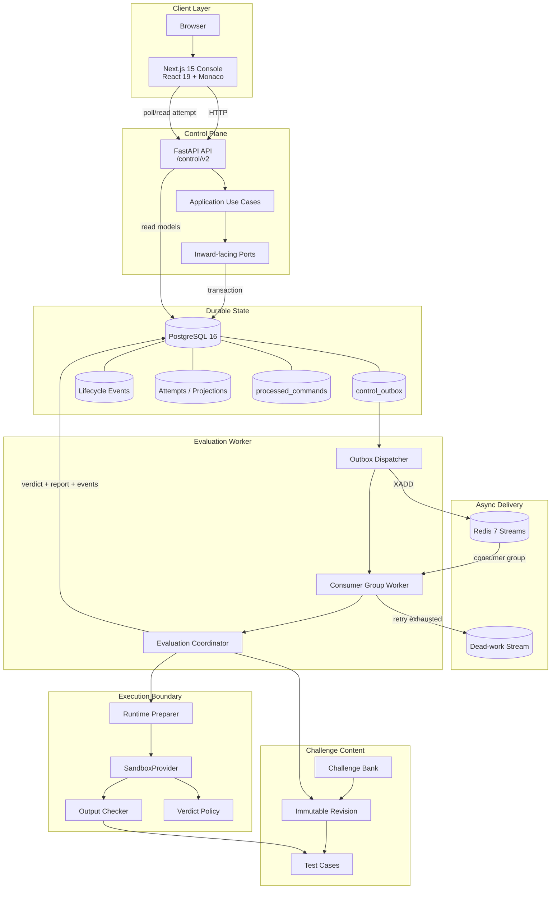
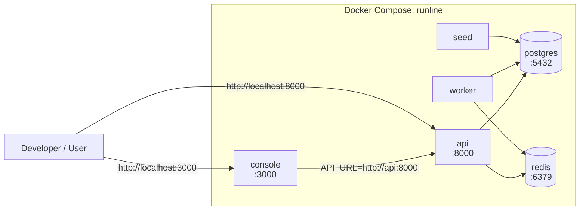
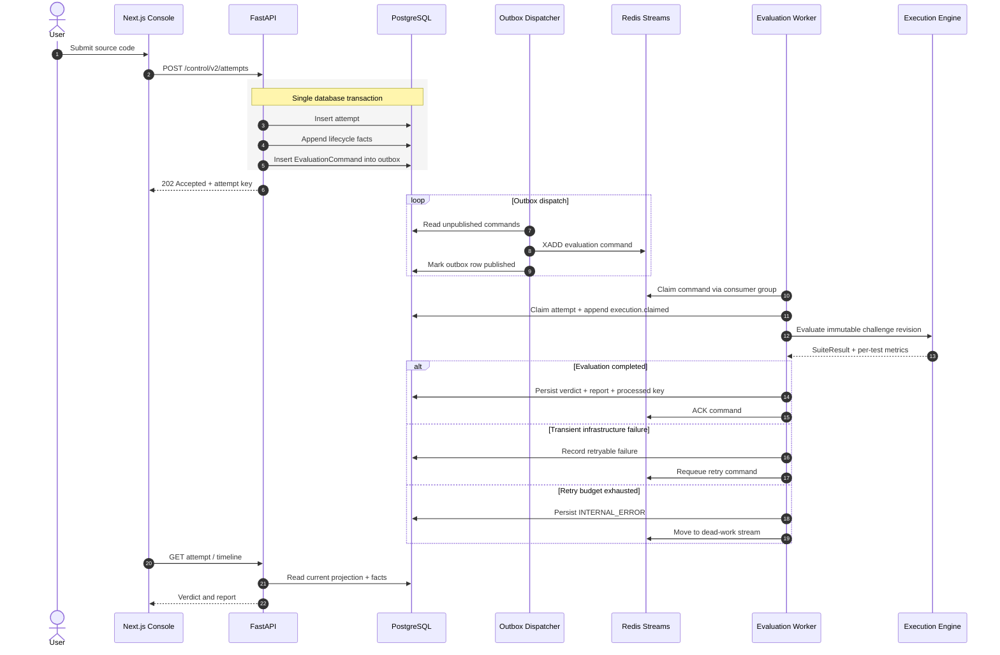
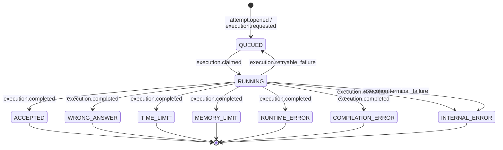
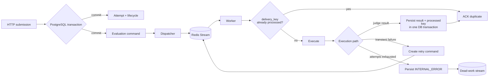
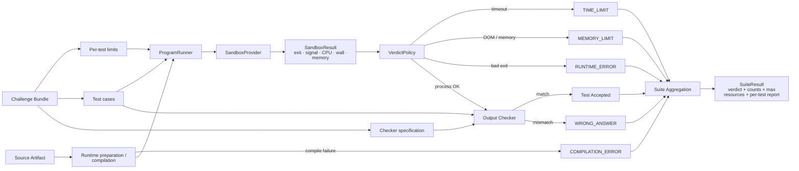
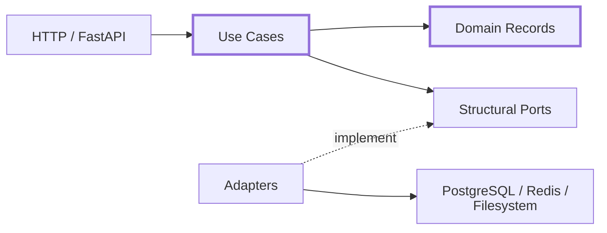

<div align="center">

# Runline

### Asynchronous online judge and evaluation platform

**Runline** is an online judge for running and evaluating programming submissions.

</div>

---

I built Runline during the **KSI Internship** under the mentorship of **Radosław Myśliwiec**.

The main goal of the project was to get hands-on experience with asynchronous processing, failure handling, execution isolation and backend architecture instead of treating a submission as one long HTTP request.

At a high level:

1. the API accepts a submission;
2. the submission and an evaluation command are saved in PostgreSQL;
3. a worker receives the command through Redis Streams;
4. the execution engine compiles and runs the submitted code against the challenge tests;
5. the result and execution history are stored back in PostgreSQL.

The repository also includes a Next.js web interface with a Monaco-based code editor.

---

## Contents

* [Architecture](#architecture)
* [Deployment topology](#deployment-topology)
* [Submission flow](#submission-flow)
* [Attempt lifecycle](#attempt-lifecycle)
* [Reliability and failure handling](#reliability-and-failure-handling)
* [Execution engine](#execution-engine)
* [Technology stack](#technology-stack)
* [Challenge bank](#challenge-bank)
* [Running locally](#running-locally)
* [Development commands](#development-commands)
* [API](#api)
* [Project structure](#project-structure)
* [Configuration](#configuration)
* [Testing](#testing)
* [Security and isolation](#security-and-isolation)
* [Architecture decisions](#architecture-decisions)
* [Limitations](#limitations)

---

## Architecture



PostgreSQL is the source of truth for attempts, lifecycle events and evaluation commands.

Redis is used for delivering work to workers. It is deliberately not required to be available at the exact moment the API accepts a submission.

That is the main reason the submission path uses a transactional outbox.

---

## Deployment topology

The development environment runs as a Docker Compose stack.



There are two API addresses on the frontend because the server and browser run in different networking contexts.

Next.js server-side code uses:

```text
API_URL=http://api:8000
```

Browser-side code uses:

```text
NEXT_PUBLIC_API_URL=http://localhost:8000
```

---

## Submission flow

The web app submits source code to:

```text
POST /control/v2/attempts
```

The API does not immediately run the program.

Instead, inside one PostgreSQL transaction, it:

* creates the attempt;
* appends its initial lifecycle events;
* stores an `EvaluationCommand` in the outbox.

The request can then return `202 Accepted`.

A separate dispatcher eventually reads the outbox record and publishes the evaluation command to Redis.



One useful property of this setup is that Redis does not have to be available at exactly the same time as the HTTP request.

If PostgreSQL commits successfully but Redis is temporarily unavailable, the evaluation command stays in the outbox and can be published later.

---

## Attempt lifecycle

An attempt normally starts in `QUEUED` and moves to `RUNNING` when an evaluation worker claims it.



Terminal states are:

```text
ACCEPTED
WRONG_ANSWER
TIME_LIMIT
MEMORY_LIMIT
RUNTIME_ERROR
COMPILATION_ERROR
INTERNAL_ERROR
```

A retryable infrastructure problem can move an attempt from `RUNNING` back to `QUEUED`.

Lifecycle events are stored separately from the current attempt projection. The projection is therefore disposable and can be rebuilt by replaying the events in sequence order.

---

## Reliability and failure handling

A large part of Runline deals with failures that can happen between accepting a submission and completing its evaluation.



Some of the failure cases the implementation tries to handle are:

| Failure                                                        | Expected behaviour                               |
| -------------------------------------------------------------- | ------------------------------------------------ |
| API crashes before the DB transaction commits                  | no accepted attempt exists                       |
| Redis is unavailable after the DB commit                       | command remains in the outbox                    |
| Dispatcher publishes the same command twice                    | duplicate delivery is tolerated                  |
| Worker dies after claiming a message                           | pending Redis message can be reclaimed           |
| Worker commits the result but dies before ACK                  | redelivery is ignored using `processed_commands` |
| Evaluation fails because of a temporary infrastructure problem | attempt can be retried                           |
| Retry budget is exhausted                                      | attempt becomes `INTERNAL_ERROR`                 |

### Idempotency

There are several places where the same operation can be received more than once, so the project uses different identifiers at different boundaries:

* request keys for duplicate submission requests;
* `delivery_key` for command delivery;
* lifecycle `dedupe_key` values for events;
* `processed_commands` for completed worker commands;
* deterministic run and retry keys.

They are separate because an HTTP duplicate, a duplicate Redis delivery and a duplicate lifecycle event are different problems.

---

## Execution engine

The execution engine is separate from the queue and persistence code.

It receives source code and a challenge bundle, prepares the runtime, runs the tests and returns a structured result.



For each test, low-level process information is converted into a contestant-facing verdict.

The policy checks things such as:

* timeout termination;
* memory-limit or OOM behaviour;
* process exit status;
* output correctness.

### Output checking

For normal deterministic tasks, output is compared using whitespace-separated tokens.

Challenges can also provide a Python custom checker when plain output comparison is not enough.

### Runtime support

| Runtime | Contract / catalogue | Local preparer |
| ------- | :------------------: | :------------: |
| Python  |          yes         |       yes      |
| C++     |          yes         |       yes      |
| Java    |          yes         |     not yet    |
| Rust    |          yes         |     not yet    |
| Go      |          yes         |     not yet    |
| Bash    |       internal       |       yes      |

Java, Rust and Go can be represented by the runtime contracts and toolchain diagnostics, but the checked-in preparer currently handles Python, C++ and Bash.

---

## Technology stack

| Part         | Technology                                 |
| ------------ | ------------------------------------------ |
| Web console  | Next.js 15, React 19, TypeScript           |
| Editor       | Monaco Editor                              |
| HTTP API     | FastAPI, Pydantic v2                       |
| Persistence  | PostgreSQL 16, SQLAlchemy Async, asyncpg   |
| Messaging    | Redis 7 Streams                            |
| Worker       | Python, asyncio                            |
| Judge engine | Python                                     |
| Isolation    | Linux process provider, optional cgroup v2 |
| Development  | Docker Compose                             |

---

## Challenge bank

Challenges live under:

```text
challenge_bank/challenges/<challenge-key>/
```

A challenge bundle usually looks like this:

```text
challenge_bank/challenges/<challenge-key>/
├── challenge.json
├── statement.md
├── samples/
├── tests/
├── model/
└── checker/
```

The repository currently contains:

* **11 challenge bundles**;
* **220 deterministic test cases**;
* public samples;
* hidden evaluation cases;
* reference implementations;
* per-test time and memory limits;
* optional custom checkers.

The complete bank can be audited with:

```bash
python tooling/audit_challenge_bank.py
```

Current result:

```text
audited 11 challenge bundles and 220 cases
```

### Immutable revisions

Evaluation commands can include a `challenge_digest`.

When a digest is present, the worker evaluates a materialized immutable revision instead of the mutable challenge files in the current working tree.

This matters for queued submissions. Editing a challenge after a submission has already been accepted should not silently change what that submission means.

---

## Running locally

### Requirements

You need:

* Docker Desktop or Docker Engine;
* Docker Compose v2;
* `curl` for the host-side readiness checks.

Clone the repository:

```bash
git clone <your-repository-url>
cd runline-control-plane-redesign
```

Start everything with:

```bash
chmod +x dev.sh
./dev.sh
```

The launcher starts:

* PostgreSQL;
* Redis;
* challenge seed job;
* FastAPI API;
* evaluation worker;
* Next.js console.

### Local services

| Service     | Address                       |
| ----------- | ----------------------------- |
| Web console | `http://localhost:3000`       |
| API         | `http://localhost:8000`       |
| Swagger UI  | `http://localhost:8000/docs`  |
| Liveness    | `http://localhost:8000/live`  |
| Readiness   | `http://localhost:8000/ready` |
| PostgreSQL  | `localhost:5432`              |
| Redis       | `localhost:6379`              |

---

## Development commands

```bash
./dev.sh
./dev.sh down
./dev.sh restart
./dev.sh rebuild
./dev.sh reset
./dev.sh status
./dev.sh logs
./dev.sh logs api
./dev.sh logs worker
./dev.sh doctor
```

For most local problems I usually start with:

```bash
./dev.sh doctor
./dev.sh logs api
./dev.sh logs worker
```

---

## API

The public API is currently versioned under:

```text
/control/v2
```

### Challenges

| Method | Endpoint                                         | Purpose                    |
| ------ | ------------------------------------------------ | -------------------------- |
| `GET`  | `/control/v2/challenges`                         | list and filter challenges |
| `GET`  | `/control/v2/challenges/{challengeKey}`          | read one challenge         |
| `GET`  | `/control/v2/challenges/{challengeKey}/attempts` | list challenge attempts    |

### Attempts

| Method | Endpoint                                     | Purpose                       |
| ------ | -------------------------------------------- | ----------------------------- |
| `POST` | `/control/v2/attempts`                       | create and queue an attempt   |
| `GET`  | `/control/v2/attempts`                       | browse attempts               |
| `GET`  | `/control/v2/attempts/{attemptKey}`          | read attempt state and report |
| `GET`  | `/control/v2/attempts/{attemptKey}/source`   | read submitted source         |
| `GET`  | `/control/v2/attempts/{attemptKey}/timeline` | read lifecycle events         |

### Accounts

| Method | Endpoint                                  | Purpose                      |
| ------ | ----------------------------------------- | ---------------------------- |
| `GET`  | `/control/v2/accounts/self`               | current development account  |
| `GET`  | `/control/v2/accounts/by-handle/{handle}` | resolve an account by handle |

### Example submission

```bash
curl -X POST http://localhost:8000/control/v2/attempts \
  -H 'Content-Type: application/json' \
  -H 'Request-Key: demo-request-001' \
  -d '{
    "challengeKey": "rl-batch-dedup",
    "runtime": "Python",
    "artifactName": "solution.py",
    "sourceText": "print(input())\n"
  }'
```

The API returns `202 Accepted` and evaluation continues asynchronously.

---

## Project structure

```text
runline-control-plane-redesign/
├── challenge_bank/
│   └── challenges/
│
├── control_plane/
│   ├── runtime/
│   │   ├── adapters/
│   │   ├── contracts/
│   │   ├── core/
│   │   ├── http/
│   │   ├── persistence/
│   │   ├── storage/
│   │   ├── use_cases/
│   │   └── worker/
│   ├── scripts/
│   └── tests/
│
├── execution_engine/
│   ├── core/
│   ├── outer/
│   ├── platform/linux/
│   ├── contracts/
│   ├── fixtures/
│   ├── tools/
│   ├── docs/
│   └── tests/
│
├── web_console/
│   ├── app/
│   ├── components/
│   ├── features/
│   └── lib/
│
├── docs/
│   └── decisions/
│
├── tooling/
├── docker-compose.yml
├── requirements-dev.txt
└── dev.sh
```

### Layer boundaries

The control plane tries to keep FastAPI and persistence-specific types at the edges.



Application workflows operate on domain records and structural ports instead of directly passing FastAPI schemas or SQLAlchemy rows through the whole application.

---

## Configuration

Backend configuration is provided through environment variables.

| Variable                      | Purpose                       |
| ----------------------------- | ----------------------------- |
| `DATABASE_URL`                | PostgreSQL connection         |
| `REDIS_URL`                   | Redis connection              |
| `API_PREFIX`                  | API prefix                    |
| `CORS_ORIGINS`                | browser CORS configuration    |
| `QUEUE_NAMESPACE`             | Redis namespace               |
| `QUEUE_GROUP`                 | Redis consumer group          |
| `QUEUE_MAX_ATTEMPTS`          | retry limit                   |
| `QUEUE_VISIBILITY_TIMEOUT_MS` | stale-message reclaim timeout |
| `AUTO_CREATE_SCHEMA`          | development schema creation   |
| `EXECUTION_USE_CGROUP`        | optional cgroup support       |
| `EXECUTION_ISOLATION`         | isolation configuration       |

Frontend networking uses:

```text
API_URL=http://api:8000
NEXT_PUBLIC_API_URL=http://localhost:8000
```

The difference is intentional.

Next.js server-side code runs inside the Docker network and can reach the API through the `api` service name.

Browser-side code runs on the host and uses `localhost`.

---

## Testing

### Control plane

```bash
python -m pytest -q control_plane/tests
```

### Execution engine

```bash
python -m pytest -q execution_engine/tests
```

### Engine smoke test

```bash
python -m execution_engine.tools.cli smoke
```

### Challenge bank

```bash
python tooling/audit_challenge_bank.py
```

### Frontend

```bash
cd web_console
npm install
npm run typecheck
npm run build
```

Some execution and isolation tests require Linux or cgroup capabilities.

---

## Security and isolation

Execution is hidden behind the `SandboxProvider` interface.

The checked-in Linux implementation currently provides development-oriented functionality such as:

* process-group execution;
* wall-clock deadlines;
* CPU and memory observation;
* optional cgroup v2 integration;
* timeout and OOM classification.

> [!WARNING]
> The included local process sandbox is **not a production-grade security boundary for hostile code**.

The default Docker Compose configuration currently has:

```text
EXECUTION_USE_CGROUP=false
```

A real multi-tenant deployment would need significantly stronger isolation, for example:

* namespaces, containers or micro-VMs;
* restricted filesystem access;
* disabled or tightly controlled networking;
* process-count limits;
* enforced CPU and memory quotas;
* syscall filtering;
* stronger artifact isolation.

The reason the execution code sits behind `SandboxProvider` is that a stronger implementation should be replaceable without changing the control plane or judge semantics.

---

## Architecture decisions

A few decisions are documented separately under:

```text
docs/decisions/
```

The main ones are summarized below.

### Inward-facing ports

Use cases depend on structural interfaces for attempts, challenges, accounts, lifecycle facts, revisions, transactions and the command outbox.

FastAPI schemas and SQLAlchemy rows stay near their adapters.

The point is to avoid making the business workflows depend directly on one HTTP or storage implementation.

### Transactional evaluation outbox

Attempt creation and evaluation-command staging happen in the same PostgreSQL transaction.

The dispatcher publishes the command to Redis afterward.

This avoids the awkward case where the API accepts a submission but crashes before the corresponding evaluation job is actually queued.

### Replaceable isolation provider

Process launching, cgroups, deadlines, filesystem exposure and wait-status handling live behind `SandboxProvider`.

The current implementation is useful for development, but it should be possible to replace it with a stronger sandbox without rewriting the rest of the judge.

---

## Limitations

Runline is still a development/internship project rather than a production online judge.

Current limitations include:

* the included process sandbox is intended for local development and capability testing, not hostile multi-tenant code;
* cgroup enforcement is disabled by default in Docker Compose;
* Java, Rust and Go preparation is not yet connected to the current local preparer map;
* authentication and authorization are intentionally minimal;
* production deployments would need proper monitoring and alerting for outbox backlog, worker lag, retries, stale pending messages and dead-work accumulation.

These limitations are intentionally kept visible rather than presenting the project as production-ready.

---

<div align="center">

### Runline

Asynchronous submission evaluation with durable state, retries and isolated execution.

</div>
